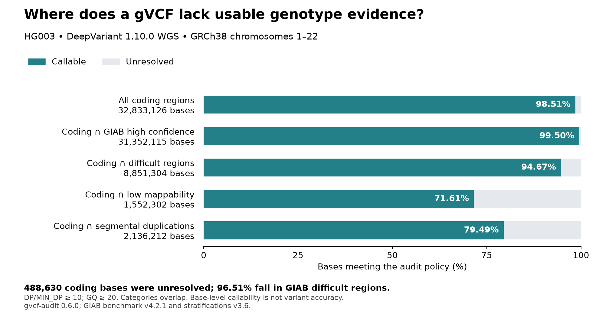

# Callability in HG002 and HG003

These examples ask where a gVCF retains usable genotype evidence, and whether its
unresolved coding bases fall in difficult genomic regions. They use complete
public whole-genome gVCFs from Google's DeepVariant case-study bucket:

- HG002: DeepTrio 1.10.0 WGS child output, with evidence from the parents.
- HG003: DeepVariant 1.10.0 WGS single-sample output.

Both audits use gvcf-audit 0.6.0, the case-study GRCh38 no-alt analysis reference,
DP/MIN_DP ≥ 10, GQ ≥ 20, and the default filter policy. The scope is the complete
union of chromosomes 1–22. Every input record is scanned, including records
outside that scope. No indexed subsampling is used.

The coding targets come from the RefSeq CDS set in GIAB stratifications v3.6.
Benchmark regions are the sample-specific GIAB v4.2.1 high-confidence BEDs.
Repeated/overlapping annotations are merged before counting bases.

## Results

| Sample / caller | Coding bases | Callable coding bases | Unresolved coding bases in difficult regions |
|---|---:|---:|---:|
| HG002 / DeepTrio 1.10.0 WGS | 32,833,126 | 32,357,872 (98.55%) | 461,109 / 475,254 (97.02%) |
| HG003 / DeepVariant 1.10.0 WGS | 32,833,126 | 32,344,496 (98.51%) | 471,584 / 488,630 (96.51%) |




Exact counts and state breakdowns are in [HG002-overlap.json](HG002-overlap.json) and [HG003-overlap.json](HG003-overlap.json).

The samples and caller configurations differ. These are two examples of using the
audit, not a comparison of caller accuracy. The difficult-region categories overlap;
never add low-mappability and segmental-duplication counts together. "Coding regions"
means this RefSeq CDS annotation, not all possible exons or an exome capture design.

## Reproduce

The source manifest pins the gVCF object generations and records the region file
checksums. Large inputs are checked by size, not by a separate checksum pass; the
audit reads and decompresses every record. The reference URL is the one published
in the case study. No lift-over is used.

Allow roughly 10 GB of disk for both gVCFs, the uncompressed reference and the full
audit outputs. The scripts need Python 3.11 or later; only plotting needs Matplotlib.
Run from the repository root with the released 0.6.0 binary on your PATH:

For the figures, first create an environment with the plotting version used here:

```sh
python3 -m venv giab-plot-env
. giab-plot-env/bin/activate
python3 -m pip install matplotlib==3.11.2
```

```sh
python3 examples/giab/fetch.py giab-data --inputs

for sample in HG002 HG003; do
    gvcf-audit --gvcf "giab-data/$sample.g.vcf.gz" \
        --reference giab-data/GRCh38_no_alt_analysis_set.fasta \
        --bed giab-data/autosomes.bed --out "$sample-audit"
    python3 examples/giab/overlap.py giab-data "$sample-audit" \
        "$sample-overlap.json" --sample "$sample"
    python3 examples/giab/check_cds.py giab-data "$sample-audit" \
        "$sample-overlap.json" "$sample-independent-check.json"
    python3 examples/giab/plot.py "$sample-overlap.json" \
        "$sample-independent-check.json" "$sample-callability"
done
```

Audit directories and overlap/check JSON outputs must be new. To use an existing audit, omit its audit command and pass
its directory to the two checking scripts. `fetch.py` without `--inputs` downloads
only the region files. Raw genomes and full audit BEDs are not stored in Git.

The interval script verifies the saved BED partition for gaps and overlaps, checks
its state totals against JSON, and checks the target and sample identity. A separate
script builds a per-base coding-region mask directly from the raw annotation rows
and checks every coding-base status count independently. The smaller hand-calculated
interval cases run in CI:

```sh
python3 examples/giab/test_overlap.py
```

The figures are descriptive base-level overlaps, not sensitivity, specificity,
variant precision or recall. No truth VCF or missed variants are evaluated.
High-confidence regions describe a benchmark's scope; membership does not guarantee
callability under this policy. Conversely, callable evidence does not prove that a
reported genotype is correct. Two related samples cannot establish general accuracy
across populations, assays or sequencing technologies.

## Reference choice

An earlier local analysis used a UCSC-based GRCh38 copy. Comparing full autosomal
sequences revealed hard-masked regions in the case-study reference, as well as small
IUPAC ambiguity differences. The published examples here rerun both inputs with the
case-study reference. Matching chromosome names and lengths alone is insufficient
proof of reference identity. The complete callable BEDs matched the earlier reference runs for both samples; the reference choice changed some whole-autosome unresolved classifications.

## Sources

- [DeepVariant WGS case study](https://github.com/google/deepvariant/blob/r1.10/docs/deepvariant-case-study.md)
- [DeepTrio WGS case study](https://github.com/google/deepvariant/blob/r1.10/docs/deeptrio-wgs-case-study.md)
- [GIAB v4.2.1 benchmark releases](https://ftp-trace.ncbi.nlm.nih.gov/giab/ftp/release/AshkenazimTrio/)
- [GIAB v3.6 stratifications](https://ftp-trace.ncbi.nlm.nih.gov/ReferenceSamples/giab/release/genome-stratifications/v3.6/README.md)
- Dwarshuis et al., [The GIAB genomic stratifications resource for human reference genomes](https://doi.org/10.1101/2023.10.27.563846).
- [Exact input URLs, versions and checksums](sources.json)
